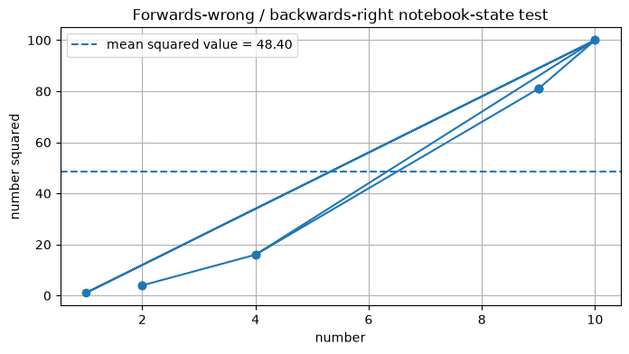
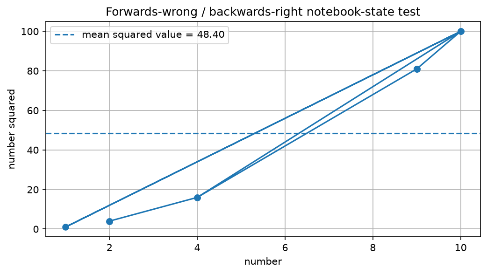

# Jupyter Log Timeline

**Multimodal Jupy Logger Markdown Timeline**

This log file: D:\David\my_repos_dwb\multimodal-jupy-logger\jupy_log\timelines\timeline.md
Timestamp: 1782766002578_2026-06-29T164642578-0400
Machine, user, etc.: BLACK-MACHINE bball@BLACK-MACHINE

---

---

---


---

## details-summary-markdown-regression

`1782759815228_2026-06-29T150335228-0400` — `text` — `text/markdown`

```
<details>
<summary>Click the arrow to reveal logged Markdown text</summary>

This content was logged as `text/markdown`.

The regression question is whether exported timelines preserve this as
renderable Markdown/HTML or incorrectly turn it into escaped or fenced
source text.

</details>

<!-- ## 9. Code cell 08 — log the original Markdown regression case -->
<!--   If I had left the python comment without the HTML comment,   -->
<!-- + it would have rendered as an `h2`. But you might only see    -->
<!-- + this in the dpypd.print_file version.                        -->

<br/>HTML comments above.<br/>Hopefully you can see the utility of jupy_log
as a note-taking device.

```

---

## details-summary-html-control

`1782759848405_2026-06-29T150408405-0400` — `html` — `text/html`

<details>
<summary>Click the arrow to reveal logged HTML text</summary>

<p>
This content was logged as <code>text/html</code>. It should be inserted
as HTML in the generated HTML timeline.
</p>

</details>

## 10. Code cell 09 — log an HTML control version

<!--   I can leave the python comment above as-is, since this is -->
<!-- + HTML and not markdown. But you might only see this in the -->
<!-- + dpypd.print_file version.                                 -->

<br/>HTML comments above.<br/>Hopefully you can see the utility of jupy_log
as a note-taking device.


---

## capture-basic-input

`1782760095550_2026-06-29T150815550-0400` — `text` — `text/x-python`

```
message = "This stdout should be displayed and logged."
print(message)

## 11. Code cell 14 — basic `%%jupy_capture` smoke test

```

---

## capture-basic-stdout

`1782760095856_2026-06-29T150815856-0400` — `text` — `text/plain`

```
This stdout should be displayed and logged.

```

---

## tee-basic-input

`1782760174892_2026-06-29T150934892-0400` — `text` — `text/x-python`

```
tee_message = "The %%jupy_tee alias executed this cell."
print(tee_message)

tee_message.upper()

## 12. Code cell 18 — basic `%%jupy_tee` alias test

```

---

## tee-basic-stdout

`1782760174910_2026-06-29T150934910-0400` — `text` — `text/plain`

```
The %%jupy_tee alias executed this cell.

```

---

## tee-basic-display-01-01-text

`1782760174921_2026-06-29T150934921-0400` — `text` — `text/plain`

```
'THE %%JUPY_TEE ALIAS EXECUTED THIS CELL.'
```

---

## abc-state-reset-input

`1782760280557_2026-06-29T151120557-0400` — `text` — `text/x-python`

```
state_names = [
    "numbers",
    "squared_numbers",
    "avg_value",
    "fig",
    "ax",
    "plot_path",
]

removed_names = []

for state_name in state_names:
    if state_name in globals():
        globals().pop(state_name)
        removed_names.append(state_name)
    ##endof:  if state_name in globals()
##endof:  for state_name in state_names

print("Removed prior state:", removed_names)
print("A and B should now fail on their first executions.")

## 14. Code cell 23 — reset hidden kernel state

```

---

## abc-state-reset-stdout

`1782760280576_2026-06-29T151120576-0400` — `text` — `text/plain`

```
Removed prior state: []
A and B should now fail on their first executions.

```

---

## abc-first-pass-a-input

`1782760399754_2026-06-29T151319754-0400` — `text` — `text/x-python`

```
##done before# import matplotlib.plotly as plt
##  P.S. Cell A does not import matplotlib here, because Cell C
##+ will do it before we come back for the successful run of
##+ already did. Same for numpy.
##+ This is intentional notebook-state dependence for the A/B/C test.

avg_value = squared_numbers.mean()

fig, ax = plt.subplots(figsize=(8, 4))

ax.plot(
    numbers,
    squared_numbers,
    marker="o",
)

ax.axhline(
    avg_value,
    linestyle="--",
    label=f"mean squared value = {avg_value:.2f}",
)

ax.set_title(
    "Forwards-wrong / backwards-right notebook-state test"
)
ax.set_xlabel("number")
ax.set_ylabel("number squared")
ax.grid(True)
ax.legend()

plot_path = (
    repo_root
    / "jupy_log"
    / "staging"
    / "abc_backwards_right.png"
)

plt.savefig(plot_path, dpi=150, bbox_inches="tight")
print("saved explicit plot file:", plot_path)
print("explicit plot exists:", plot_path.exists())

plt.show()

## 15. Code cell         27 — A, 1st execution: expected failure
#
## and
#
## 20. Code cell (still) 27 — A, 2nd execution: expected success and plot capture
##     call it Code Cell 27|43

```

---

## abc-first-pass-a-exception

`1782760400224_2026-06-29T151320224-0400` — `text` — `text/plain`

```
Traceback (most recent call last):
  File "D:\David\my_repos_dwb\multimodal-jupy-logger\.venv_mmjl_test\Lib\site-packages\IPython\core\interactiveshell.py", line 3748, in run_code
    exec(code_obj, self.user_global_ns, self.user_ns)
    ~~~~^^^^^^^^^^^^^^^^^^^^^^^^^^^^^^^^^^^^^^^^^^^^^
  File "C:\Users\bball\AppData\Local\Temp\ipykernel_13164\2702192110.py", line 7, in <module>
    avg_value = squared_numbers.mean()
                ^^^^^^^^^^^^^^^
NameError: name 'squared_numbers' is not defined

```

---

## abc-first-pass-b-input

`1782760985810_2026-06-29T152305810-0400` — `text` — `text/x-python`

```
squared_numbers = numbers ** 2

print("squared_numbers:", squared_numbers)

## 16. Code cell         32 — B, first execution: expected failure
#
## and
#
## 18. Code cell (still) 32 — B, second execution: expected success
##     call it Code cell 32|40

```

---

## abc-first-pass-b-exception

`1782760985837_2026-06-29T152305837-0400` — `text` — `text/plain`

```
Traceback (most recent call last):
  File "D:\David\my_repos_dwb\multimodal-jupy-logger\.venv_mmjl_test\Lib\site-packages\IPython\core\interactiveshell.py", line 3748, in run_code
    exec(code_obj, self.user_global_ns, self.user_ns)
    ~~~~^^^^^^^^^^^^^^^^^^^^^^^^^^^^^^^^^^^^^^^^^^^^^
  File "C:\Users\bball\AppData\Local\Temp\ipykernel_13164\2522802886.py", line 1, in <module>
    squared_numbers = numbers ** 2
                      ^^^^^^^
NameError: name 'numbers' is not defined. Did you forget to import 'numbers'?

```

---

## abc-cell-c-input

`1782761483982_2026-06-29T153123982-0400` — `text` — `text/x-python`

```
import numpy as np
import matplotlib.pyplot as plt

## Older global-random-state style, like MLU
# numbers = np.random.randint(1, 11, size=10)

rng = np.random.default_rng()
numbers = rng.integers(1, 11, size=10)

print("numbers:", numbers)

## 17. Code cell 36 — C: expected success

```

---

## abc-cell-c-stdout

`1782761484600_2026-06-29T153124600-0400` — `text` — `text/plain`

```
numbers: [ 2  2  4 10  1 10  9  9  9  4]

```

---

## abc-second-pass-b-input

`1782761684196_2026-06-29T153444196-0400` — `text` — `text/x-python`

```
squared_numbers = numbers ** 2

print("squared_numbers:", squared_numbers)

## 16. Code cell         32 — B, first execution: expected failure
#
## and
#
## 18. Code cell (still) 32 — B, second execution: expected success
##     call it Code cell 32|40

```

---

## abc-second-pass-b-stdout

`1782761684212_2026-06-29T153444212-0400` — `text` — `text/plain`

```
squared_numbers: [  4   4  16 100   1 100  81  81  81  16]

```

---

## abc-second-pass-a-input

`1782762473892_2026-06-29T154753892-0400` — `text` — `text/x-python`

```
##done before# import matplotlib.plotly as plt
##  P.S. Cell A does not import matplotlib here, because Cell C
##+ will do it before we come back for the successful run of
##+ already did. Same for numpy.
##+ This is intentional notebook-state dependence for the A/B/C test.

avg_value = squared_numbers.mean()

fig, ax = plt.subplots(figsize=(8, 4))

ax.plot(
    numbers,
    squared_numbers,
    marker="o",
)

ax.axhline(
    avg_value,
    linestyle="--",
    label=f"mean squared value = {avg_value:.2f}",
)

ax.set_title(
    "Forwards-wrong / backwards-right notebook-state test"
)
ax.set_xlabel("number")
ax.set_ylabel("number squared")
ax.grid(True)
ax.legend()

plot_path = (
    repo_root
    / "jupy_log"
    / "staging"
    / "abc_backwards_right.png"
)

plt.savefig(plot_path, dpi=150, bbox_inches="tight")
print("saved explicit plot file:", plot_path)
print("explicit plot exists:", plot_path.exists())

plt.show()

## 15. Code cell         27 — A, 1st execution: expected failure
#
## and
#
## 20. Code cell (still) 27 — A, 2nd execution: expected success and plot capture
##     call it Code Cell 27|44

```

---

## abc-second-pass-a-stdout

`1782762474682_2026-06-29T154754682-0400` — `text` — `text/plain`

```
saved explicit plot file: D:\David\my_repos_dwb\multimodal-jupy-logger\jupy_log\staging\abc_backwards_right.png
explicit plot exists: True

```

---

## abc-second-pass-a-display-01-01-text

`1782762474692_2026-06-29T154754692-0400` — `text` — `text/plain`

```
<Figure size 800x400 with 1 Axes>
```

---

## abc-second-pass-a-display-01-02-image

`1782762474700_2026-06-29T154754700-0400` — `image` — `image/png`



---

## abc-explicit-plot-01

`1782764942837_2026-06-29T162902837-0400` — `image` — `image/png`


